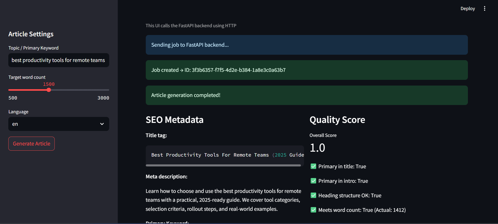

# SEO Article Agent – Backend Take-Home

This project implements an **agent-based backend service** that generates SEO-optimized, publish-ready articles for a given topic.

The system:

1. Fetches / mocks SERP (search engine result) data.
2. Analyzes top results to understand themes and secondary keywords.
3. Builds a structured outline aligned with search intent.
4. Generates a human-style article with proper heading hierarchy (H1 / H2 / H3).
5. Produces SEO metadata, structured data (JSON-LD), internal linking suggestions, external references, FAQ, and a simple content quality score.

You can use it via:

- **FastAPI** (JSON API)  
- **Streamlit** (UI on top of the FastAPI API)

---

## Installation

python -m venv venv
source venv/bin/activate      # on Windows: venv\Scripts\activate
pip install -r requirements.txt

---

## Running the FastAPI Backend
### Start the API:

uvicorn app.main:app --reload

---

## Running the Streamlit Frontend (HTTP → API)

### The Streamlit app calls the FastAPI backend via HTTP:

1. Start FastAPI (if not already running):
uvicorn app.main:app --reload
2. Start Streamlit:
streamlit run streamlit_app_http.py
Streamlit will open at http://localhost:8501.

## Streamlit UI – Input & Output Example
###  Example Input (Streamlit UI)

The following settings were entered in the Streamlit frontend:

| Field | Value |
|------|--------|
| Topic / Primary Keyword | best productivity tools for remote teams |
| Target Word Count | 1500 |
| Language | en |

After clicking **“Generate Article”**, the Streamlit app sends this request to the FastAPI backend:

---

 After processing is complete, Streamlit displays the following data:

### 🖥️ Streamlit UI Preview

---

#### Input Screen

---

## Design Decisions

This project was intentionally designed with a **clean separation between domain logic, API orchestration, and user interface**, so each layer can evolve independently.

### 1. Service-First Architecture
All core intelligence (SERP analysis, outline generation, article writing, SEO scoring) lives inside a dedicated `services/` layer. This ensures that:
- The business logic is **framework-agnostic**.
- The same agent pipeline can be reused by both the :contentReference[oaicite:0]{index=0} backend and the :contentReference[oaicite:1]{index=1} frontend.
- Swapping the template-based generator with a real LLM later requires **minimal refactoring**.

---

### 2. Explicit, Typed Data Models
All inputs and outputs are defined using :contentReference[oaicite:2]{index=2} models:
- SERP results  
- SERP analysis  
- Outline structure  
- SEO metadata  
- Article content  
- Job state  

This guarantees:
- **Schema consistency** across all pipeline stages.
- **Programmatic validation** of SEO output.
- A clear contract for frontend consumption.

---

### 3. Asynchronous Job-Based Processing
Article generation is handled as a **background job** instead of a blocking request:
- Each job has a lifecycle: `pending → running → completed / failed`
- This models real production systems where:
  - SERP collection
  - Analysis
  - Draft generation  
  may take time.
- It enables **polling, recovery, and future persistence to a database**.

---

### 4. Template-Driven Generation (Deliberate Choice)
Instead of directly calling a large language model:
- A **deterministic template generator** was implemented.
- This ensures:
  - Fully reproducible output
  - Easier testing
  - Clear demonstration of **SEO logic over raw text generation**
- The system is structured so an LLM can later replace only the `ArticleGenerator` without touching the rest of the pipeline.

---

### 5. SEO as a First-Class Concern
SEO is not treated as an afterthought. The system explicitly enforces:
- Primary keyword in:
  - Title
  - Introduction
- Hierarchical heading structure (H1 / H2 / H3)
- Keyword analysis & density
- Internal linking suggestions
- External authority references
- JSON-LD structured data for validation

A **content quality score** is computed to verify these constraints.

---

### 6. Streamlit as a True API Consumer
The Streamlit frontend does **not directly call service classes**. Instead it:
- Sends `POST /api/jobs` to the backend
- Polls `GET /api/jobs/{job_id}` until completion
- Renders only the final structured response  

This cleanly demonstrates:
- **Frontend–backend decoupling**
- API-driven architecture
- Real-world integration style

---

### 7. Simplicity Over Over-Engineering
For a 4–6 hour take-home assignment:
- An in-memory job store was chosen over a database.
- A mocked SERP client was used instead of live API keys.
- This keeps the system:
  - Fully runnable out-of-the-box
  - Easy for reviewers to test
  - Focused on architecture and reasoning instead of DevOps setup

---

### Summary
The core design goal was to demonstrate:
- **Agent-style reasoning**
- **Structured, SEO-aware data generation**
- **Scalable backend patterns**
- **Clean separation of concerns**
- **Real frontend consumption via HTTP**

The architecture mirrors how a production AI content platform would be built — just without external dependencies.

